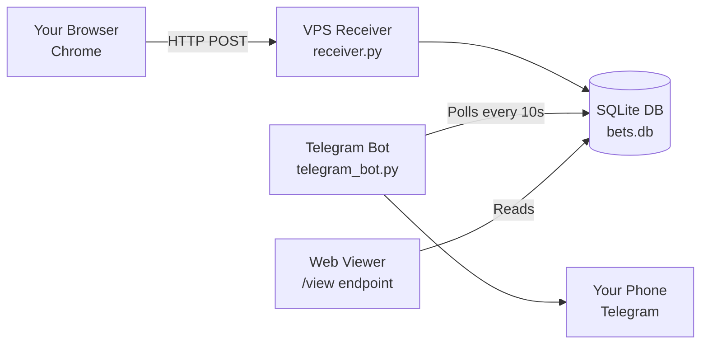

# System Architecture

**Last Updated:** 2025-12-11

This document explains how the HighRoller OCR system works under the hood.

---

## Table of Contents

1. [Overview](#overview)
2. [Components](#components)
3. [Data Flow](#data-flow)
4. [Configuration](#configuration)
5. [Database Schema](#database-schema)
6. [Deployment Architecture](#deployment-architecture)

---

## Overview

The HighRoller system is a **hybrid architecture** that combines:
- **Client-side scraping** (your browser)
- **Server-side storage** (VPS)
- **Automated alerts** (Telegram bot)



**Why Hybrid?**
- Browser = Access to Stake.com data (no API)
- VPS = 24/7 uptime, persistent storage
- Separation = Browser can close, data persists

---

## Components

### 1. Browser Script (`highroller_v5.1_strict_fixed.js`)

**Location:** Runs in Chrome console on your PC  
**Language:** JavaScript  
**Purpose:** Scrapes Stake.com High Rollers table

**What it does:**
1. Watches the High Rollers table for new rows (MutationObserver)
2. Parses bet data: event, user, time, odds, amount
3. Filters: Only forwards bets ≥ $2,500
4. Captures slip URLs for bets ≥ $14,750 (clicks "Bet Preview" button)
5. Sends data to VPS via HTTP POST

**Key Functions:**
- `parseRow(tr)` - Extracts data from table row
- `parseAmount(raw)` - Parses currency and value
- `extractSlipURLFromRow(tr)` - Clicks button and captures URL
- `forward(payload)` - POSTs to VPS

**Configuration:**
```javascript
ENDPOINT: "http://31.97.215.169:5001/bets"
TOKEN: "j6TOV8FDviMFVdyTNzgvHnPjsflfEg2ECSxRPPiAWKg"
FEED_MIN: 2500   // Minimum bet to forward
SLIP_MIN: 14750  // Minimum bet to capture slip URL
```

**Deduplication:**
Uses localStorage to track already-seen bets (key = event|time|amount).

---

### 2. VPS Receiver (`receiver.py`)

**Location:** VPS (31.97.215.169:5001)  
**Language:** Python (Flask)  
**Purpose:** HTTP API to receive and store bet data

**Endpoints:**

| Endpoint | Method | Purpose |
|----------|--------|---------|
| `/bets` | POST | Receive bet data from browser |
| `/bets` | GET | Health check (returns status message) |
| `/view` | GET | HTML viewer showing recent bets |
| `/` | GET | Simple health endpoint |

**What it does:**
1. Validates auth token (`x-auth-token` header)
2. Processes incoming bet data (type: "feed" or "slip")
3. Deduplicates using 60-second time window
4. Saves to SQLite database
5. Serves web viewer with real-time stats

**Deduplication Logic:**
```python
DEDUP_WINDOW = 60  # seconds
# If same (key, type) within 60s → skip
```

**CORS Configuration:**
Allows requests from `stake.com` (HTTPS) to accept HTTP POST from browser.

---

### 3. Database (`database.py` + `bets.db`)

**Location:** VPS `/root/highroller/bets.db`  
**Type:** SQLite  
**Purpose:** Persistent storage for all bet data

**Schema:** See [Database Schema](#database-schema) section below.

**Functions:**
- `insert_bet(payload)` - Saves a bet to DB
- `get_recent_bets(limit)` - Retrieves recent bets for viewer/bot

---

### 4. Telegram Bot (`telegram_bot.py`)

**Location:** VPS (runs in Docker container)  
**Language:** Python  
**Purpose:** Polls database and sends Telegram alerts

**What it does:**
1. Runs infinite loop (sleeps 10s between checks)
2. Queries database for bets ≥ $5,000 that haven't been alerted yet
3. Formats message with emoji and bet details
4. Sends to configured Telegram chat
5. Marks bet as "alerted" in database

**Configuration:**
```python
TELEGRAM_TOKEN = "8292074725:AAE9Asxr8aSDh-wxS7tNjMcEm_jQBmwLqqc"
TELEGRAM_CHAT_ID = "6258896163"
MIN_AMOUNT = 5000  # Only alert for bets ≥ $5k
```

**Message Format:**
```
🎰 High Roller Alert!
💰 Amount: $50,000.00
📊 Event: Lakers vs Celtics
⚖️ Odds: 2.15
🔗 Slip: https://stake.com/...
```

---

## Data Flow

### Flow 1: Normal Bet (< $14,750)

```
1. User places $5,000 bet on Stake.com
2. Browser script detects new row
3. Parses: event="Lakers vs Celtics", amount=5000
4. Checks: 5000 >= 2500 ✅
5. POSTs to VPS: {type: "feed", ...}
6. VPS saves to database
7. Telegram bot (next poll) sees $5k bet
8. Sends alert to Telegram
```

### Flow 2: High-Value Bet (≥ $14,750)

```
1. User places $50,000 bet on Stake.com
2. Browser script detects new row
3. Parses data
4. Checks: 50000 >= 2500 ✅
5. POSTs to VPS: {type: "feed", ...}
6. Checks: 50000 >= 14750 ✅
7. Clicks "Bet Preview" button
8. Waits 1.5s for modal
9. Extracts slip URL from modal
10. POSTs to VPS: {type: "slip", slip_url: "https://..."}
11. VPS saves both entries (feed + slip)
12. Telegram bot sends alert with slip URL
```

---

## Configuration

### Browser Script Config

**File:** `highroller_v5.1_strict_fixed.js` (lines 59-69)

```javascript
const CONFIG = Object.freeze({
  ENDPOINT: "http://31.97.215.169:5001/bets",  // VPS URL
  TOKEN: "j6TOV8FDviMFVdyTNzgvHnPjsflfEg2ECSxRPPiAWKg",
  FEED_MIN: 2500,    // Minimum to forward
  SLIP_MIN: 14750,   // Minimum for slip URL
  MAX_TABS: 5,       // Max background tabs (for slip capture)
  STRICT: true       // Strict table parsing (must be 5 columns)
});
```

### VPS Config

**File:** `docker-compose.yml`

```yaml
services:
  receiver:
    ports:
      - "5001:5001"
    environment:
      - AUTH_TOKEN=${AUTH_TOKEN}
      
  telegram-bot:
    environment:
      - TELEGRAM_TOKEN=8292074725:AAE9Asxr8aSDh-wxS7tNjMcEm_jQBmwLqqc
      - TELEGRAM_CHAT_ID=6258896163
```

### Database Location

**Production:** `/root/highroller/bets.db` (on VPS)  
**Local Dev:** `./bets.db` (in project root)

---

## Database Schema

### Table: `bets`

```sql
CREATE TABLE bets (
    id INTEGER PRIMARY KEY AUTOINCREMENT,
    timestamp REAL,           -- Unix timestamp
    detected_at TEXT,         -- ISO 8601 timestamp
    type TEXT,                -- "feed" or "slip"
    key TEXT,                 -- Dedup key (event|time|amount)
    event TEXT,               -- Event name
    user TEXT,                -- Username (if available)
    time TEXT,                -- Time string (e.g. "5:30 PM")
    time_str TEXT,            -- Alternative time field
    odds TEXT,                -- Odds (e.g. "2.15")
    amount_raw TEXT,          -- Original string (e.g. "$5,000.00")
    amount_value REAL,        -- Numeric value for filtering
    currency TEXT,            -- "USD", "CAD", etc.
    slip_url TEXT,            -- Bet slip URL (if type="slip")
    slip_id TEXT,             -- Slip ID (extracted from URL)
    error TEXT,               -- Error message (if capture failed)
    telegram_sent INTEGER DEFAULT 0  -- 1 if alert sent
);

CREATE INDEX idx_bets_key_type ON bets(key, type);
CREATE INDEX idx_bets_timestamp ON bets(timestamp);
```

**Key Fields:**
- `type`: "feed" (bet data) or "slip" (slip URL)
- `key`: Used for deduplication
- `telegram_sent`: Prevents duplicate alerts

---

## Deployment Architecture

### Production (Current)

```
┌─────────────────────┐
│   Your PC/Laptop    │
│                     │
│  Chrome Browser     │
│  ├─ Stake.com       │
│  └─ Console Script  │
└──────────┬──────────┘
           │ HTTP POST
           ↓
┌─────────────────────────────┐
│  VPS (31.97.215.169)        │
│                             │
│  ┌───────────────────────┐  │
│  │ Docker Container      │  │
│  │  ├─ receiver.py:5001  │  │
│  │  ├─ telegram_bot.py   │  │
│  │  └─ bets.db           │  │
│  └───────────────────────┘  │
│                             │
│  Hostinger VPS              │
└─────────────┬───────────────┘
              │
              ↓
        Telegram API
              │
              ↓
      ┌──────────────┐
      │  Your Phone  │
      └──────────────┘
```

### Why VPS + Browser?

**Option 1: Full Cloud (Headless Browser on VPS)**
- ❌ Expensive (Chrome requires 2GB+ RAM)
- ❌ Stake.com might detect/block automation
- ❌ Complex setup (Puppeteer, anti-detection)

**Option 2: Full Local (Everything on PC)**
- ❌ PC must be on 24/7
- ❌ No alerts when PC is off
- ❌ Data lost if PC crashes

**Option 3: Hybrid (Current)**
- ✅ Cheap (minimal VPS usage)
- ✅ Data persists even if PC is off
- ✅ Telegram bot runs 24/7
- ⚠️ Requires browser tab to stay open

---

## Security

### Authentication
- Browser → VPS: Token-based (`x-auth-token` header)
- VPS → Telegram: Telegram bot token

### Network
- Browser → VPS: HTTP (not HTTPS)
  - **Why:** Mixed Content blocking requires browser setting change
  - **Alternative:** Use ngrok for HTTPS tunnel (adds complexity)

### Data Privacy
- No user passwords stored
- Only public bet data captured
- Database on private VPS

---

## Limitations

1. **Browser Dependency:** Requires Chrome tab to stay open
2. **HTTP vs HTTPS:** Mixed Content setting required
3. **Slip URL Capture:** Depends on Stake.com UI (can break if they change button selectors)
4. **Rate Limiting:** No rate limiting on VPS (assumes trusted source)

---

## Future Improvements

### Phase 3: Headless Automation
Replace browser script with headless Chrome on VPS:
- ✅ No browser tab required
- ✅ True 24/7 operation
- ❌ Requires 2GB+ VPS
- ❌ Risk of detection

### Alternative: Ngrok HTTPS
Add ngrok for HTTPS endpoint:
- ✅ No Mixed Content errors
- ✅ Secure connection
- ⚠️ Requires ngrok running on VPS
- ⚠️ Free tier has limits

---

## Monitoring

### Check if System is Working

**1. Browser:**
```javascript
// In console
FEED.status  // Should show config
```

**2. VPS Receiver:**
```bash
curl http://31.97.215.169:5001/bets
# Should return: {"message": "HighRoller Receiver is running", "status": "active"}
```

**3. Database:**
```bash
ssh root@31.97.215.169
sqlite3 /root/highroller/bets.db "SELECT COUNT(*) FROM bets WHERE timestamp > $(date -d '1 hour ago' +%s)"
```

**4. Telegram Bot:**
```bash
ssh root@31.97.215.169
docker logs -f highroller_bot
```

**5. Web Viewer:**
Open: http://31.97.215.169:5001/view

---

## Technical Decisions

### Why SQLite?
- Simple, no separate DB server needed
- Perfect for single-writer (receiver.py) + multiple readers
- Easy backups (just copy bets.db file)
- < 1MB for thousands of bets

### Why Flask?
- Lightweight (receiver is <500 lines)
- Easy CORS configuration
- Built-in development server works for production (low traffic)

### Why Docker?
- Ensures receiver + bot restart on VPS reboot
- Isolated environment (no dependency conflicts)
- Easy deployment (`docker-compose up -d`)

### Why Not WebSockets?
- HTTP POST is simpler
- Browser doesn't need persistent connection
- VPS can restart without browser knowing

---

## Related Documents

- **Deployment:** [DEPLOYMENT.md](DEPLOYMENT.md)
- **Troubleshooting:** [TROUBLESHOOTING.md](TROUBLESHOOTING.md)
- **Quick Start:** [QUICKSTART.md](QUICKSTART.md)
